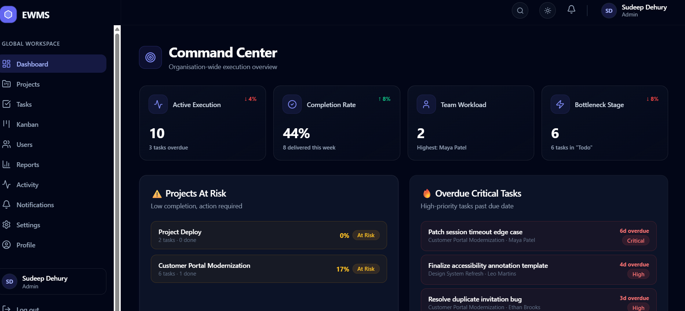

# Enterprise Work Management System

A full-stack enterprise work management platform for role-based project delivery, task execution, realtime notifications, activity tracking, and analytics.

The application is built as a JavaScript-only ESM monorepo with a React + Vite frontend and a Node.js + Express + MongoDB backend. It is designed to demonstrate production-style architecture, clean role-based workflows, responsive enterprise UI, and realtime state synchronization.

## Live Links

- Frontend: https://enterprise-work-management-system-w.vercel.app
- Backend: Render deployment URL: **TODO: add deployed Render service URL**
- Health check: `https://<your-render-service>.onrender.com/api/health`

## Key Features

### Authentication and Roles

- JWT-based login and signup.
- Role-based access for Admin, Manager, and Employee.
- Protected routes and role guards for authenticated workspace pages.
- Profile editing, profile image upload, and password change flows.

### Dashboard

- Role-aware dashboard for workspace, team, and personal execution views.
- Metrics for projects, tasks, completion, pending work, overdue work, and workload.
- Workspace telemetry feed for recent operational activity.
- Realtime updates through Socket.IO.

### Projects and Tasks

- Create, edit, and manage projects.
- Create, assign, edit, move, and archive tasks.
- Task types: Bug, Feature, and Improvement.
- Priorities, due dates, comments, attachments, assignees, reporters, and project membership.
- Cloudinary-backed profile images and task attachments.

### Kanban

- Drag-and-drop task board powered by `@dnd-kit`.
- Status columns for task execution.
- Touch-friendly interaction improvements and mobile fallback controls.
- Cards stay synchronized with the latest task, project, and user identity data.

### User Management

- Admin/manager guarded user management route.
- Admin user lifecycle controls with activation/deactivation instead of destructive user deletion.
- User cards show role, team, manager relationship, status, and activity-oriented metadata.

### Reporting and Analytics

- Reports page with chart-based workspace insights using Recharts.
- Project health, workload, execution status, priority distribution, overdue work, and completion signals.
- Dashboard analytics components reused across the app.

### Notifications, Activity, and Telemetry

- Toast alerts and realtime notification updates.
- Personal notification delete and clear controls.
- Activity Log and Workspace Telemetry show scoped operational actions, including self actions.
- Feed clearing is personal-level only; no global admin purge controls are exposed in the normal UI.

### Settings and Profile

- Persisted light/dark theme.
- Profile update and profile image management.
- Password change flow.
- Topbar avatar/name block links directly to the Profile page.

## Role Overview

| Role | High-Level Capabilities |
| --- | --- |
| Admin | Global workspace visibility, project/task administration, user management, reports, activity, notifications, and settings. |
| Manager | Manage scoped projects and team work, assign and update tasks, review reports, and view team activity. |
| Employee | View and update assigned work, move permitted tasks, comment, manage personal profile/settings, and receive relevant notifications. |

## Tech Stack

### Frontend

- React 19
- Vite 7
- Redux Toolkit
- React Redux
- React Router
- Tailwind CSS
- React Hook Form
- Yup
- Axios
- Socket.IO Client
- Recharts
- `@dnd-kit`
- Framer Motion
- React Toastify
- Lucide React
- Jest
- React Testing Library

### Backend

- Node.js
- Express
- MongoDB
- Mongoose
- JSON Web Token authentication
- bcryptjs
- Socket.IO
- CORS
- dotenv
- multer
- Cloudinary

### Tooling

- JavaScript only
- ESM only
- ESLint
- Prettier
- npm workspaces
- Vercel frontend deployment
- Render backend deployment

## Architecture

```text
Enterprise-Work-Management-System/
  apps/
    api/
      src/
        config/          # environment, CORS, Cloudinary config
        controllers/     # route handlers
        db/              # MongoDB connection
        middleware/      # auth, RBAC, uploads, errors
        models/          # Mongoose models
        routes/          # Express route modules
        seed/            # demo data seeding
        services/        # auth/user/cloudinary helpers
        sockets/         # Socket.IO server
        utils/           # JWT and permission helpers
    web/
      src/
        app/             # app shell and router provider
        components/      # shared layout components
        features/        # feature modules
        hooks/           # reusable React hooks
        lib/             # permissions/storage helpers
        pages/           # auth pages
        routes/          # route config and guards
        services/        # API/socket clients
        store/           # Redux slices/selectors
        test-utils/      # test helpers
        __tests__/       # Jest + RTL tests
  package.json
  package-lock.json
  README.md
```

## Installation and Local Setup

### Prerequisites

- Node.js 22.x
- npm
- MongoDB local instance or MongoDB Atlas URI
- Optional: Cloudinary account for profile images and task attachments

### 1. Clone and install

```bash
git clone <your-repository-url>
cd Enterprise-Work-Management-System
npm install
```

### 2. Configure environment variables

Create backend and frontend environment files from the examples:

```bash
cp apps/api/.env.example apps/api/.env
cp apps/web/.env.example apps/web/.env
```

On Windows PowerShell, create/copy the files manually or run:

```powershell
Copy-Item apps/api/.env.example apps/api/.env
Copy-Item apps/web/.env.example apps/web/.env
```

### 3. Seed demo data

```bash
node apps/api/src/seed/seed.js
```

The seed script clears existing demo collections and creates users, projects, tasks, comments, notifications, and activity logs.

### 4. Run the backend

```bash
npm run dev:api
```

Default API origin: `http://localhost:5000`

### 5. Run the frontend

```bash
npm run dev:web
```

Default frontend origin: `http://localhost:5173`

## Environment Variables

### Backend: `apps/api/.env`

```env
PORT=5000
CLIENT_URL=http://localhost:5173
JWT_SECRET=replace_with_a_strong_secret
JWT_EXPIRES_IN=8h
MONGODB_URI=mongodb://127.0.0.1:27017/ewms
CLOUDINARY_CLOUD_NAME=your_cloud_name
CLOUDINARY_API_KEY=your_api_key
CLOUDINARY_API_SECRET=your_api_secret
```

Production notes:

- Set `CLIENT_URL` to the deployed Vercel frontend origin.
- Use a strong non-demo `JWT_SECRET`.
- Use a production MongoDB Atlas URI.
- Configure Cloudinary values if profile image and attachment upload should work in production.

### Frontend: `apps/web/.env`

```env
VITE_API_URL=http://localhost:5000
VITE_SOCKET_URL=http://localhost:5000
```

Production notes:

- Set both values to the deployed backend origin, for example `https://<your-render-service>.onrender.com`.
- The frontend automatically appends `/api` for REST calls when needed.

## Demo Credentials

Seeded users from `apps/api/src/seed/seed.js`:

| Role | Name | Email | Password |
| --- | --- | --- | --- |
| Admin | Olivia Chen | `admin@demo.com` | `Admin@123` |
| Manager | Kunal Shah | `kunal.manager@demo.com` | `Manager@123` |
| Manager | Priya Nair | `priya.manager@demo.com` | `Manager@123` |
| Employee | Maya Patel | `maya.employee@demo.com` | `Employee@123` |
| Employee | Ethan Brooks | `ethan.employee@demo.com` | `Employee@123` |
| Employee | Anika Rao | `anika.employee@demo.com` | `Employee@123` |
| Employee | Leo Martins | `leo.employee@demo.com` | `Employee@123` |

## Scripts

Run from the repository root:

```bash
npm run dev:web      # start Vite frontend
npm run dev:api      # start Express backend
npm run build        # build frontend
npm run test         # run frontend Jest test suite
npm run lint         # lint frontend and backend
npm run format       # format repository with Prettier
```

Workspace-specific commands:

```bash
npm run lint -w apps/api
npm run lint -w apps/web
npm run test -w apps/web
npm run build -w apps/web
npm start -w apps/api
```

## Testing

The frontend uses **Jest** with **React Testing Library** and `@testing-library/user-event`.

Current test suite:

- 15 test files
- 31 passing tests
- Includes integration-style user flow coverage for authentication, route guards, protected routes, notifications, forms, Kanban selectors, Redux slices, and user-management UI behavior.

Run tests:

```bash
npm run test -w apps/web
```

Linting:

```bash
npm run lint -w apps/web
npm run lint -w apps/api
```

## Deployment

### Frontend: Vercel

The frontend is deployed from `apps/web`.

- Live frontend: https://enterprise-work-management-system-w.vercel.app
- SPA routing is handled by `apps/web/vercel.json`.
- Required production variables:
  - `VITE_API_URL`
  - `VITE_SOCKET_URL`

### Backend: Render

The backend is designed to deploy from `apps/api`.

Recommended Render settings:

- Root directory: `apps/api`
- Build command: `npm install`
- Start command: `npm start`
- Node version: 22.x

Required production variables:

- `PORT`
- `CLIENT_URL`
- `JWT_SECRET`
- `JWT_EXPIRES_IN`
- `MONGODB_URI`
- `CLOUDINARY_CLOUD_NAME`
- `CLOUDINARY_API_KEY`
- `CLOUDINARY_API_SECRET`

After deployment, verify:

```text
GET /api/health
```

## Screenshots

Screenshots are not currently committed in the repository.

Suggested README assets to add before final submission:

```text
docs/screenshots/landing.png
docs/screenshots/dashboard.png
docs/screenshots/tasks.png
docs/screenshots/kanban.png
docs/screenshots/reports.png
docs/screenshots/settings.png
```

Then reference them here:

```md

```

## Assignment Criteria Mapping

| Requirement | Status | Evidence |
| --- | --- | --- |
| UI/UX Design & Responsiveness | Satisfied | Tailwind-based responsive layouts, dark/light theme, animated premium UI, mobile Kanban refinements. |
| Code Quality & Best Practices | Satisfied | ESM modules, feature-based frontend structure, Express route/controller/service layering, ESLint/Prettier, scoped permissions. |
| Functionalities & Features | Satisfied | Auth, roles, dashboard, projects, tasks, Kanban, users, reports, notifications, settings, comments, attachments. |
| State Management & Interactivity | Satisfied | Redux Toolkit async thunks/selectors, Socket.IO realtime events, React Router guards, interactive forms and drag/drop. |
| Deployment & Documentation | Mostly satisfied | Vercel frontend deployed, backend Render-ready/deployed per project context, README now documents setup/deployment. Backend URL should be filled in. |
| JWT Authentication | Satisfied | Express auth routes, JWT utilities, protected frontend routes. |
| Admin/Manager/Employee Roles | Satisfied | Backend permission helpers and frontend route/action guards. |
| Dashboard Metrics | Satisfied | Dashboard selectors and analytics components. |
| Project & Task Module | Satisfied | CRUD-style project/task workflows, assignment, archive, comments, attachments, priorities, due dates. |
| Kanban Drag-and-Drop | Satisfied | `@dnd-kit` board with synced Redux task data. |
| User Management | Satisfied | Admin/manager guarded users page and backend user routes. |
| Reporting & Analytics | Satisfied | Recharts reports and dashboard chart components. |
| Notifications/WebSockets | Satisfied | Socket.IO realtime events, notification UI, toast alerts. |
| Settings/Profile | Satisfied | Theme toggle, profile edit, profile image, password change. |
| Jest + React Testing Library | Satisfied | Jest config, RTL setup, 15 test files, 31 passing tests. |
| Screenshots | Pending manual addition | No committed app screenshots found. Placeholder section included. |

## Known Limitations and Future Improvements

- Add committed screenshots before final evaluator submission.
- Fill in the deployed Render backend URL in this README.
- API test coverage is lighter than frontend test coverage; future work could add backend integration tests for auth, RBAC, CORS, and task workflows.
- The frontend production bundle currently emits a large chunk warning; code-splitting can be tuned further if required.
- Admin/manager route visibility is implemented, while the highest-value future refinement would be documenting exact RBAC rules in a dedicated policy file.

## Submission Readiness

The project is functionally strong and aligned with the assignment requirements. It is ready with minor manual documentation completion:

1. Add the Render backend URL.
2. Add screenshots.
3. Ensure deployed frontend environment variables point to the deployed backend:
   - `VITE_API_URL`
   - `VITE_SOCKET_URL`

