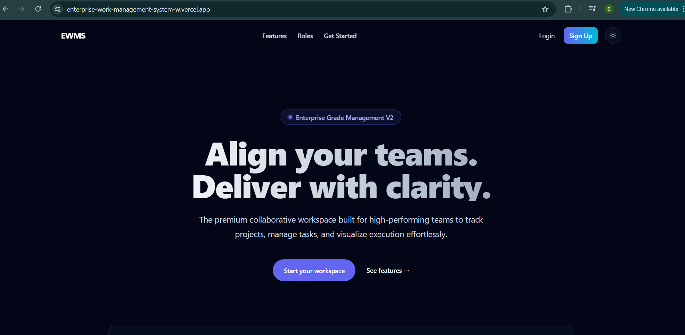
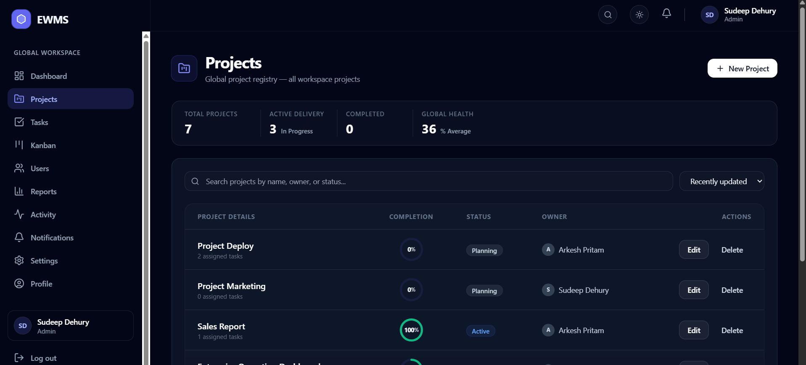
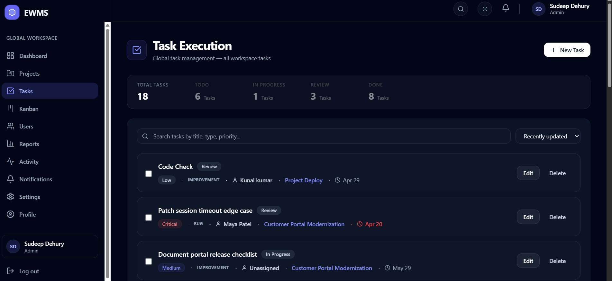
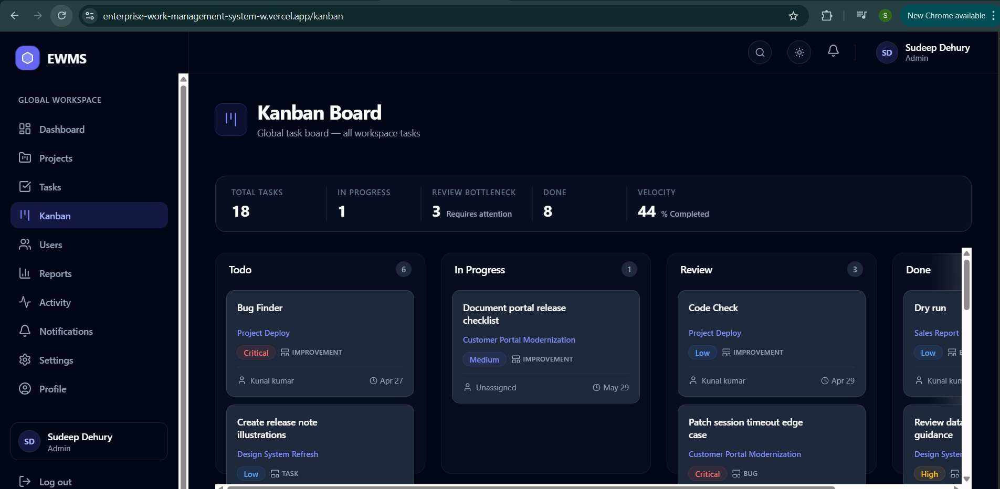
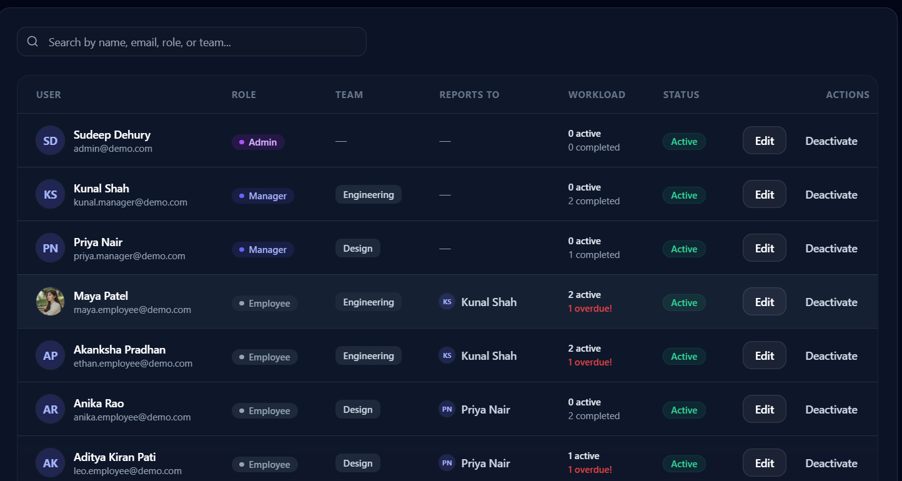
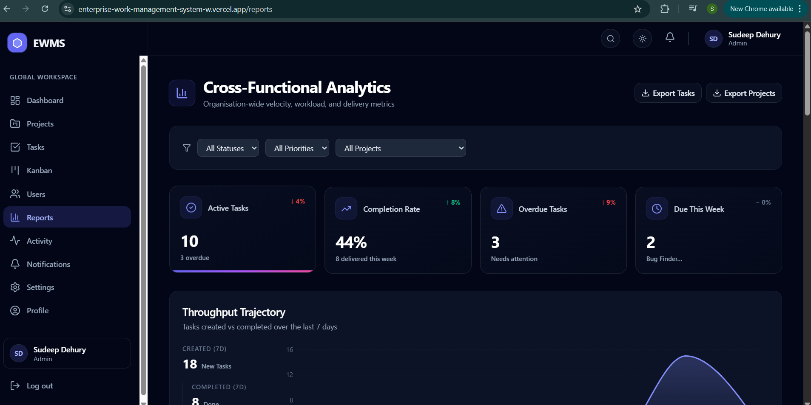
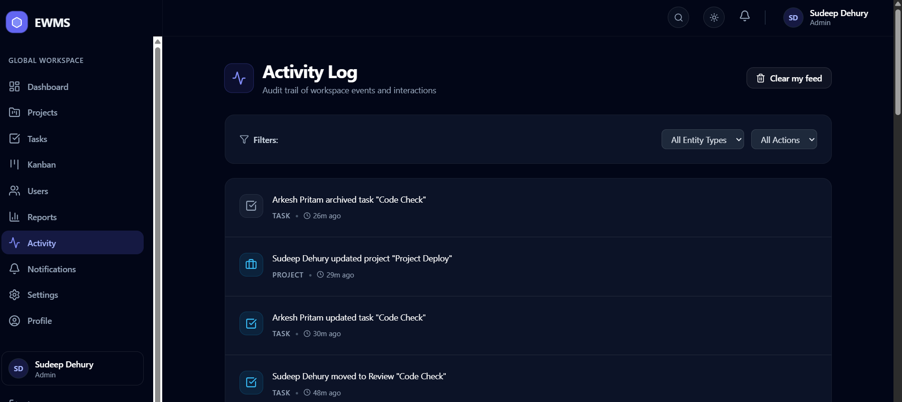
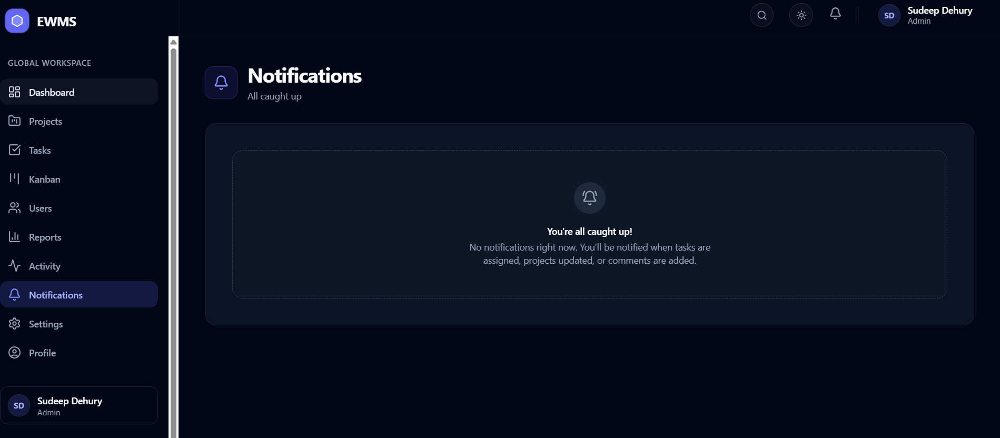
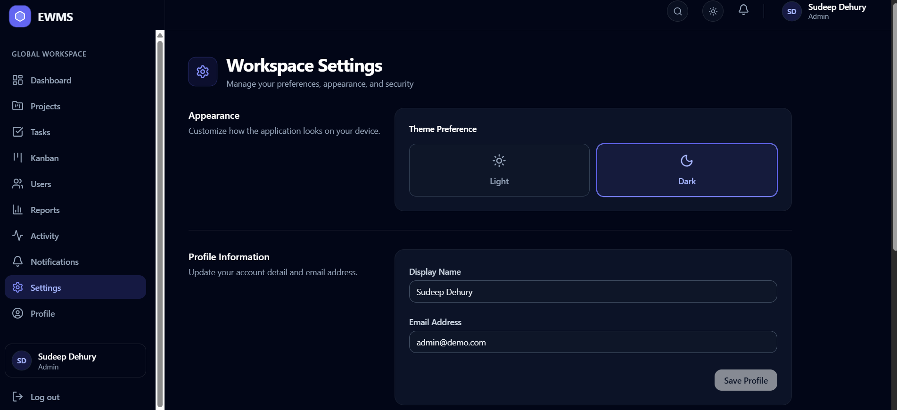
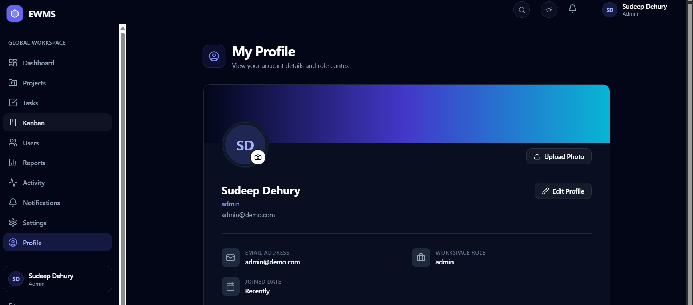

# Enterprise Work Management System

A full-stack enterprise work management platform for role-based project delivery, task execution, realtime notifications, activity tracking, and analytics.

The application is built as a JavaScript-only ESM monorepo with a React + Vite frontend and a Node.js + Express + MongoDB backend. It is designed to demonstrate production-style architecture, clean role-based workflows, responsive enterprise UI, and realtime state synchronization.

## Live Links

- Frontend: https://enterprise-work-management-system-w.vercel.app
- Backend: https://enterprise-work-management-system.onrender.com
- Health check: https://enterprise-work-management-system.onrender.com/api/health

## Key Features

### Authentication and Roles

- JWT-based login and signup.
- Role-based access for Admin, Manager, and Employee.
- Protected routes and role guards for authenticated workspace pages.
- Profile editing, profile image upload, and password change flows.

### Dashboard

- Role-aware dashboard for workspace, team, and personal execution views.
- Metrics for projects, tasks, completion, pending work, overdue work, and workload.
- Workspace telemetry feed for recent operational activity.
- Realtime updates through Socket.IO.

### Projects and Tasks

- Create, edit, and manage projects.
- Create, assign, edit, move, and delete tasks.
- Task types: Bug, Feature, and Improvement.
- Priorities, due dates, comments, attachments, assignees, reporters, and project membership.
- Cloudinary-backed profile images and task attachments.

### Kanban

- Drag-and-drop task board powered by `@dnd-kit`.
- Status columns for task execution.
- Touch-friendly interaction improvements and mobile fallback controls.
- Cards stay synchronized with the latest task, project, and user identity data.

### User Management

- Admin/manager guarded user management route.
- Admin user lifecycle controls with activation/deactivation instead of destructive user deletion.
- User cards show role, team, manager relationship, status, and activity-oriented metadata.

### Reporting and Analytics

- Reports page with chart-based workspace insights using Recharts.
- Project health, workload, execution status, priority distribution, overdue work, and completion signals.
- Dashboard analytics components reused across the app.

### Notifications, Activity, and Telemetry

- Toast alerts and realtime notification updates.
- Personal notification delete and clear controls.
- Activity Log and Workspace Telemetry show scoped operational actions, including self actions.
- Feed clearing is personal-level only; no global admin purge controls are exposed in the normal UI.

### Settings and Profile

- Persisted light/dark theme.
- Profile update and profile image management.
- Password change flow.
- Topbar avatar/name block links directly to the Profile page.

## Role Overview

| Role | High-Level Capabilities |
| --- | --- |
| Admin | Global workspace visibility, project/task administration, user management, reports, activity, notifications, and settings. |
| Manager | Manage scoped projects and team work, assign and update tasks, review reports, and view team activity. |
| Employee | View and update assigned work, move permitted tasks, comment, manage personal profile/settings, and receive relevant notifications. |

## Tech Stack

### Frontend

- React 19
- Vite 7
- Redux Toolkit
- React Redux
- React Router
- Tailwind CSS
- React Hook Form
- Yup
- Axios
- Socket.IO Client
- Recharts
- `@dnd-kit`
- Framer Motion
- React Toastify
- Lucide React
- Jest
- React Testing Library

## Frontend Libraries Used

The frontend app in `apps/web` uses these primary runtime libraries:

| Library | Purpose |
| --- | --- |
| `react` | Component-based UI rendering. |
| `react-dom` | React DOM rendering entry point. |
| `@vitejs/plugin-react` | React support for Vite during development/build tooling. |
| `@reduxjs/toolkit` | Redux store setup, slices, reducers, and async thunks. |
| `react-redux` | React bindings for Redux state and dispatch. |
| `react-router-dom` | Client-side routing, nested layouts, protected routes, and navigation. |
| `axios` | HTTP client for backend API requests. |
| `socket.io-client` | Realtime WebSocket communication with the backend. |
| `tailwindcss` | Utility-first styling and responsive UI design. |
| `react-hook-form` | Form state management and submission handling. |
| `@hookform/resolvers` | Validation resolver integration for React Hook Form. |
| `yup` | Form validation schemas. |
| `@dnd-kit/core` | Drag-and-drop foundation for the Kanban board. |
| `@dnd-kit/sortable` | Sortable drag-and-drop behavior for Kanban interactions. |
| `recharts` | Dashboard and reports data visualizations. |
| `framer-motion` | UI transitions, page animations, modals, and polished motion. |
| `react-toastify` | Toast alerts for success, error, and realtime feedback. |
| `lucide-react` | Icon system used across navigation, buttons, cards, and actions. |

Frontend testing/dev libraries include:

| Library | Purpose |
| --- | --- |
| `jest` | JavaScript test runner. |
| `jest-environment-jsdom` | Browser-like DOM environment for tests. |
| `@testing-library/react` | React component testing utilities. |
| `@testing-library/jest-dom` | Custom DOM matchers for Jest assertions. |
| `@testing-library/user-event` | User-focused interaction testing. |
| `@swc/jest` | Jest transform for modern JavaScript and JSX. |
| `eslint` | Static analysis and code quality checks. |
| `eslint-plugin-react-hooks` | React Hooks linting rules. |
| `eslint-config-prettier` | Prevents ESLint and Prettier formatting conflicts. |
| `postcss` | CSS processing pipeline used by Tailwind. |
| `autoprefixer` | Vendor prefix handling for CSS. |
| `identity-obj-proxy` | CSS module/style mock support in tests. |

### Backend

- Node.js
- Express
- MongoDB
- Mongoose
- JSON Web Token authentication
- bcryptjs
- Socket.IO
- CORS
- dotenv
- multer
- Cloudinary

### Tooling

- JavaScript only
- ESM only
- ESLint
- Prettier
- npm workspaces
- Vercel frontend deployment
- Render backend deployment

## Architecture

```text
Enterprise-Work-Management-System/
  apps/
    api/
      src/
        config/          # environment, CORS, Cloudinary config
        controllers/     # route handlers
        db/              # MongoDB connection
        middleware/      # auth, RBAC, uploads, errors
        models/          # Mongoose models
        routes/          # Express route modules
        seed/            # demo data seeding
        services/        # auth/user/cloudinary helpers
        sockets/         # Socket.IO server
        utils/           # JWT and permission helpers
    web/
      src/
        app/             # app shell and router provider
        components/      # shared layout components
        features/        # feature modules
        hooks/           # reusable React hooks
        lib/             # permissions/storage helpers
        pages/           # auth pages
        routes/          # route config and guards
        services/        # API/socket clients
        store/           # Redux slices/selectors
        test-utils/      # test helpers
        __tests__/       # Jest + RTL tests
  package.json
  package-lock.json
  README.md
```

## Installation and Local Setup

### Prerequisites

- Node.js 22.x
- npm
- MongoDB local instance or MongoDB Atlas URI
- Optional: Cloudinary account for profile images and task attachments

### 1. Clone and install

```bash
git clone <your-repository-url>
cd Enterprise-Work-Management-System
npm install
```

### 2. Configure environment variables

Create backend and frontend environment files from the examples:

```bash
cp apps/api/.env.example apps/api/.env
cp apps/web/.env.example apps/web/.env
```

On Windows PowerShell, create/copy the files manually or run:

```powershell
Copy-Item apps/api/.env.example apps/api/.env
Copy-Item apps/web/.env.example apps/web/.env
```

### 3. Seed demo data

```bash
node apps/api/src/seed/seed.js
```

The seed script clears existing demo collections and creates users, projects, tasks, comments, notifications, and activity logs.

### 4. Run the backend

```bash
npm run dev:api
```

Default API origin: `http://localhost:5000`

### 5. Run the frontend

```bash
npm run dev:web
```

Default frontend origin: `http://localhost:5173`

## Environment Variables

### Backend: `apps/api/.env`

```env
PORT=5000
CLIENT_URL=http://localhost:5173
JWT_SECRET=replace_with_a_strong_secret
JWT_EXPIRES_IN=8h
MONGODB_URI=mongodb://127.0.0.1:27017/ewms
CLOUDINARY_CLOUD_NAME=your_cloud_name
CLOUDINARY_API_KEY=your_api_key
CLOUDINARY_API_SECRET=your_api_secret
```

Production notes:

- Set `CLIENT_URL` to the deployed Vercel frontend origin.
- Use a strong non-demo `JWT_SECRET`.
- Use a production MongoDB Atlas URI.
- Configure Cloudinary values if profile image and attachment upload should work in production.

### Frontend: `apps/web/.env`

```env
VITE_API_URL=http://localhost:5000
VITE_SOCKET_URL=http://localhost:5000
```

Production notes:

- Set both values to the deployed backend origin: `https://enterprise-work-management-system.onrender.com`.
- The frontend automatically appends `/api` for REST calls when needed.

## Demo Credentials

Seeded demo users from `apps/api/src/seed/seed.js`:

| Role | Name | Email | Password |
| --- | --- | --- | --- |
| Admin | Sudeep Dehury | `admin@demo.com` | `Admin@123` |
| Manager | Kunal Shah | `kunal.manager@demo.com` | `Manager@123` |
| Manager | Priya Nair | `priya.manager@demo.com` | `Manager@123` |
| Employee | Maya Patel | `maya.employee@demo.com` | `Employee@123` |
| Employee | Akanksha Pradhan | `ethan.employee@demo.com` | `Employee@123` |
| Employee | Anika Rao | `anika.employee@demo.com` | `Employee@123` |
| Employee | Aditya Kiran Pati | `leo.employee@demo.com` | `Employee@123` |

## Scripts

Run from the repository root:

```bash
npm run dev:web      # start Vite frontend
npm run dev:api      # start Express backend
npm run build        # build frontend
npm run test         # run frontend Jest test suite
npm run lint         # lint frontend and backend
npm run format       # format repository with Prettier
```

Workspace-specific commands:

```bash
npm run lint -w apps/api
npm run lint -w apps/web
npm run test -w apps/web
npm run build -w apps/web
npm start -w apps/api
```

## Testing & Coverage

The frontend uses **Jest** with **React Testing Library** and `@testing-library/user-event`. The test suite focuses on meaningful business behavior across the Enterprise Work Management System, including authentication, role-based access control, protected routing, form validation, Redux state transitions, scoped UI rendering, realtime state updates, and realistic user workflows.

Key coverage areas:

- Authentication flows, login validation, signup validation, auth error handling, and protected route behavior.
- Role-based access control for Admin, Manager, and Employee permissions.
- Permission helper coverage for project, task, user, and assignment rules.
- Form validation for task creation, project creation, user creation/editing, password updates, and due-date rules.
- Scoped UI rendering for dashboard variants, users, tasks, projects, notifications, and employee-restricted workflows.
- Redux Toolkit coverage for auth/work state transitions, async thunk behavior, socket-style realtime upserts, notification/activity deduping, and clearing activity feeds.
- Integration-style user flows including login -> create project -> assign task and employee task execution with RBAC restrictions.

Testing requirements coverage:

- Unit/component tests cover more than the required 5 components/pages, including Auth pages, Dashboard, UsersPage, UserForm, ProjectsPage, ProjectForm, TasksPage, TaskForm, EmployeeTaskUpdate, NotificationsPage, PasswordForm, CommandPalette, ProtectedRoute, and RoleGuard.
- Integration tests include the required user-flow example: login -> create project -> assign task.
- Additional integration coverage verifies employee task execution with RBAC restrictions.

Current quality metrics:

```text
Test Suites: 24 passed
Tests:       58 passed
Coverage:    62.45% statements
Lint:        Passed for both web and API
```

Coverage is intentionally focused on critical business logic and user-facing behavior rather than shallow static markup tests, keeping the suite useful for regression protection and assignment evaluation.

Run tests:

```bash
npm run test -w apps/web
```

Run coverage:

```bash
npm test -- --coverage
```

Linting:

```bash
npm run lint -w apps/web
npm run lint -w apps/api
```

## Deployment

### Frontend: Vercel

The frontend is deployed from `apps/web`.

- Live frontend: https://enterprise-work-management-system-w.vercel.app
- SPA routing is handled by `apps/web/vercel.json`.
- Required production variables:
  - `VITE_API_URL`
  - `VITE_SOCKET_URL`

### Backend: Render

The backend is already deployed on Render and serves the production API for the Vercel frontend.

- Live backend: https://enterprise-work-management-system.onrender.com
- Health check: https://enterprise-work-management-system.onrender.com/api/health
- Production API base URL: `https://enterprise-work-management-system.onrender.com/api`

Current Render deployment configuration:

| Setting | Value |
| --- | --- |
| Platform | Render Web Service |
| Root Directory | `apps/api` |
| Build Command | `npm install` |
| Start Command | `npm start` |
| Runtime | Node.js 22.x |
| Database | MongoDB Atlas |
| File/Image Storage | Cloudinary |

Production environment variables configured in Render:

| Variable | Purpose |
| --- | --- |
| `PORT` | Backend server port provided by Render. |
| `CLIENT_URL` | Deployed Vercel frontend URL used for CORS. |
| `JWT_SECRET` | Secure JWT signing secret. |
| `JWT_EXPIRES_IN` | JWT session expiry duration. |
| `MONGODB_URI` | MongoDB Atlas production database connection string. |
| `CLOUDINARY_CLOUD_NAME` | Cloudinary cloud name for media uploads. |
| `CLOUDINARY_API_KEY` | Cloudinary API key. |
| `CLOUDINARY_API_SECRET` | Cloudinary API secret. |

Post-deployment verification:

```text
GET https://enterprise-work-management-system.onrender.com/api/health
```

Verified health response from the deployed Render backend:

```json
{
  "status": "ok",
  "uptime": 408.70188035,
  "timestamp": "2026-04-26T11:17:34.017Z"
}
```

This confirms that the deployed backend is live and responding successfully. The `uptime` and `timestamp` values will change each time the health endpoint is checked.

## Screenshots

The screenshots below show the deployed application flows and are stored under `docs/screenshots/`.

### Landing Page



### Dashboard


### Projects



### Tasks



### Kanban Board



### Users Management



### Reports and Analytics



### Activity Log



### Notifications



### Settings



### Profile




